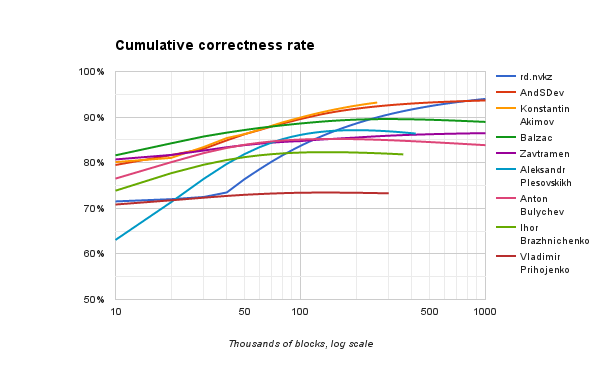
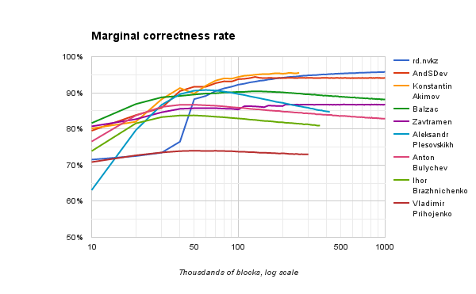
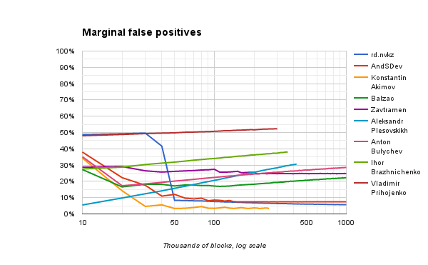

*[Previous post](05-final-standings.md)*

We promised to publish an analysis of the solutions that learn from the inputs given to them. We are terribly sorry for the delay.

This post also announces the winners of the special prizes.

## Learning solutions

We found 9 submissions to exhibit self-learning behavior. That is, their correctness rate improves as they are being continuously tested.

The idea is quite simple. Words belong to a limited dictionary, while nonwords are generated randomly. For this reason, any string that is seen repeatedly by the program being tested, is more likely to be a word than a nonword. If the testing continues long enough, most words in the dictionary will have been seen repeatedly. Nonwords can repeat, too, but because the space from which they are drawn is much bigger, this is far more seldom.

The nine learning submissions that we received deserved a separate comparison, which is now presented here.

### Baseline correctness

First, we decided to see how the learning solutions would perform if they weren't allowed to learn at all. We ran them in a special mode where the solution is restarted every time a new block contains a word already seen.

In the table below, the baseline correctness and error rates were measured on 10,000 words (the same amount as we used in the main section). The baseline rank is the overall rank a solution would have had if it hadn't been allowed to learn (that is, if we ran all solutions in restart mode).

The table is ordered by the baseline correctness rate. As you can see, some of these solutions show strong results even without the learning effects.

<table>
  <thead>
    <tr>
      <th rowspan="2">#</th>
      <th rowspan="2">ID</th>
      <th colspan="4">Baseline (10,000 blocks, with restarts)</th>
      <th colspan="4">Main (10,000 blocks, without restarts)</th>
    </tr>
    <tr>
      <th>Rank</th>
      <th>Correct</th>
      <th>F-</th>
      <th>F+</th>
      <th>Rank</th>
      <th>Correct</th>
      <th>F-</th>
      <th>F+</th>
    </tr>
  </thead>
  <tbody>
    <tr>
      <td>1</td>
      <td><a href="../submissions/5748dc5763905b3a11d97d02">Balzac</a></td>
      <td>14</td>
      <td>80.72%</td>
      <td>3.50%</td>
      <td>35.11%</td>
      <td>6</td>
      <td>81.62%</td>
      <td>9.52%</td>
      <td>27.26%</td>
    </tr>
    <tr>
      <td>2</td>
      <td><a href="../submissions/57484a0663905b3a11d97c62">Konstantin Akimov</a></td>
      <td>20</td>
      <td>80.13%</td>
      <td>5.50%</td>
      <td>34.28%</td>
      <td>21</td>
      <td>80.13%</td>
      <td>5.50%</td>
      <td>34.28%</td>
    </tr>
    <tr>
      <td>3</td>
      <td><a href="../submissions/57461bcb63905b3a11d97be7">AndSDev</a></td>
      <td>29</td>
      <td>79.12%</td>
      <td>1.58%</td>
      <td>40.23%</td>
      <td>27</td>
      <td>79.50%</td>
      <td>3.05%</td>
      <td>37.99%</td>
    </tr>
    <tr>
      <td>4</td>
      <td><a href="../submissions/5748c99463905b3a11d97cdb">Zavtramen</a></td>
      <td>30</td>
      <td>79.06%</td>
      <td>13.55%</td>
      <td>28.35%</td>
      <td>15</td>
      <td>80.71%</td>
      <td>9.92%</td>
      <td>28.67%</td>
    </tr>
    <tr>
      <td>5</td>
      <td><a href="../submissions/5748cffe63905b3a11d97ce5">Anton Bulychev</a></td>
      <td>64</td>
      <td>75.20%</td>
      <td>5.81%</td>
      <td>43.83%</td>
      <td>53</td>
      <td>76.53%</td>
      <td>11.84%</td>
      <td>35.13%</td>
    </tr>
    <tr>
      <td>6</td>
      <td><a href="../submissions/5747c9f463905b3a11d97c3a">rd.nvkz</a></td>
      <td>100</td>
      <td>71.27%</td>
      <td>9.27%</td>
      <td>48.24%</td>
      <td>92</td>
      <td>71.51%</td>
      <td>8.31%</td>
      <td>48.72%</td>
    </tr>
    <tr>
      <td>7</td>
      <td><a href="../submissions/5748d90363905b3a11d97cf5">Vladimir Prihojenko</a></td>
      <td>117</td>
      <td>69.42%</td>
      <td>14.23%</td>
      <td>46.97%</td>
      <td>103</td>
      <td>70.83%</td>
      <td>10.39%</td>
      <td>48.01%</td>
    </tr>
    <tr>
      <td>8</td>
      <td><a href="../submissions/57488d9763905b3a11d97c80">Ihor Brazhnichenko</a></td>
      <td>122</td>
      <td>67.99%</td>
      <td>14.93%</td>
      <td>49.13%</td>
      <td>76</td>
      <td>73.86%</td>
      <td>24.68%</td>
      <td>27.61%</td>
    </tr>
    <tr>
      <td>9</td>
      <td><a href="../submissions/57407f40a6200f18777121d1">Aleksandr Plesovskikh</a></td>
      <td>235</td>
      <td>49.93%</td>
      <td>100%</td>
      <td>0%</td>
      <td>168</td>
      <td>63.03%</td>
      <td>68.30%</td>
      <td>5.49%</td>
    </tr>
  </tbody>
</table>

The raw results of the run on 10,000 blocks with restarts are available as a [JSON file](../res-learning/10k-restart.json).

### Large-scale learning effects

It takes way more than 10,000 blocks for most dictionary words to appear at least twice each. To explore the learning potential fully, we used a much larger set: 1,000,000 blocks. (Arguably, we should have used it to test all submissions in the first place, but because many of the submissions weren't optimized for performance, it would have taken us months.) This larger dataset is an extension of the official testcase sequence, so the first 10,000 blocks are the same as in the main set.

When tested on such a large set, 4 of the 9 solutions ran out of memory and crashed. The table below summarizes each solution's final achievement; for those that crashed, the last achievement before the crash is shown. For performance reasons, our test system was configured to dump intermediate results only every 10,000 blocks, so the actual achievements by the crashing solutions are probably slightly better. The table below is ordered by the last achieved correctness rate.

We discovered that Node.js behaves in a nondeterministic manner even on identical programs with identical inputs. This causes the same solution to crash at different times when the entire set of tests is run repeatedly. Below are the results of one such experiment; your results might be slightly different.

| # | ID | Blocks | Correct | F- | F+ |
|---|----|--------|---------|----|----|
| 1 | [rd.nvkz](../submissions/5747c9f463905b3a11d97c3a) | 1,000,000 | 93.99% | 4.12% | 7.90% |
| 2 | [AndSDev](../submissions/57461bcb63905b3a11d97be7) | 1,000,000 | 93.65% | 4.52% | 8.19% |
| 3 | [Konstantin Akimov](../submissions/57484a0663905b3a11d97c62) | 260,000 | 93.20% | 8.28% | 5.32% |
| 4 | [Balzac](../submissions/5748dc5763905b3a11d97d02) | 1,000,000 | 88.94% | 1.80% | 20.31% |
| 5 | [Zavtramen](../submissions/5748c99463905b3a11d97cdb) | 1,000,000 | 86.48% | 1.95% | 25.09% |
| 6 | [Aleksandr Plesovskikh](../submissions/57407f40a6200f18777121d1) | 420,000 | 86.39% | 3.00% | 24.23% |
| 7 | [Anton Bulychev](../submissions/5748cffe63905b3a11d97ce5) | 1,000,000 | 83.84% | 6.03% | 26.28% |
| 8 | [Ihor Brazhnichenko](../submissions/57488d9763905b3a11d97c80) | 360,000 | 81.82% | 1.21% | 35.17% |
| 9 | [Vladimir Prihojenko](../submissions/5748d90363905b3a11d97cf5) | 300,000 | 73.28% | 2.37% | 51.08% |

The following graph shows how the correctness rate of the solutions improves with the number of blocks processed. Note that the horizontal scale is logarithmic.

For the following graph, we calculated the correctness rate on the latest 10,000 blocks at each point. This highlights the effects of learning even better, showing how well the solution performs after the learning, without the early learning period bringing down the average.

The following two graphs show how the false negative and false positive rates changed over time. Here, the rates are also marginal (that is, calculated for the latest 10,000 blocks at each point).

Interestingly, some of the solutions become worse after an initial period of improvement. The graph of false positives provides a likely explanation: because nonwords are generated randomly, they, too, can appear repeatedly (especially if they are short), albeit it happens much less freuqntly than with words. This leads to the accumulation of certain nonwords that the solution mistakes for words. Depending on the details of the learning algorithm, some solutions are more prone to this effect than others, and some seem to be completely immune to it.

The raw results of the run on 1,000,000 blocks are available as a [JSON file](../res-learning/1m.json).

### Special prizes

We had declared that we would award two special prizes, and we decided to hand them to the authors of the best learning solutions. There wasn't an official criterion for what counts as “best”, so here is our rationale.

One **400 USD** special prize goes to **rd.nvkz**, whose solution achieved the highest correctness rate we have seen, 93.99%. The learning potential of this solution is impressive: it kept improving long after the marginal correctness rates of most other solutions stabilized or even started to degrade.

Another **400 USD** special prize goes to **Balzac** for the best combination of the learning and non-learning parts. The baseline (non-learning) result of 80.72% is the best of all learning solutions, and it would rank 14th in the main results if learning were forbidden for everybody. However, learning put this solution 6th in the main standings with 10,000 blocks. This solution is the quickest to learn: already at 20,000 blocks it overtakes the best non-learning solution, and keeps the leadership until 70,000 blocks.

Congratulations to the winners of the special awards!
